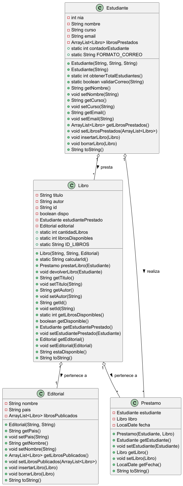

# Servicio de compra de MERCADAW

## Ínidce
1. [Resumen](#resumen)
2. Estructura de Clases
   - Diagrama UML
   - Clase Cliente
   - Clase Pedido
   - Enum Producto
4. Programa Principal **AppZonaClientes**
5. [Pruebas](#pruebas)
6. Entrega

## Resumen
> Con esta App facilitamos las Compras Onilne en MercaDaw
El programa se divide en 2 partes:
- App Mantenimiento.[en proceso]
- App Zona Clientes para autenticarse y realizar pedidos

  ## Estructura de Clase
  Utilizaremos Programación Orientada a Objetos (P.O.O.) y la siquiente estructura

  ### Diagrama UML
   

  ### Codigo Java


```` Java

  package org.example.inmutabilidad;

import java.util.ArrayList;
import java.util.Arrays;
import java.util.Collections;
import java.util.List;

public class Arbitro {

    List<String> listaArbi = new ArrayList<>(Arrays.asList("Gil Manzano", "Negreira", "Clos Gómez"));


    //todo le que utilize este metodo no lo va a poder modificar la lista.
    public List<String> getListaArbi(){
        return Collections.unmodifiableList(listaArbi);
    }

    @Override
    public String toString() {
        return "Arbitro{" +
                "listaArbi=" + listaArbi +
                '}';
    }

}

  
````

## Pruebas

> [!NOTE]
> Useful information that users should know, even when skimming content.

> [!TIP]
> Helpful advice for doing things better or more easily.

> [!IMPORTANT]
> Key information users need to know to achieve their goal.

> [!WARNING]
> Urgent info that needs immediate user attention to avoid problems.

> [!CAUTION]
> Advises about risks or negative outcomes of certain actions.

## Entrega
- [ ] **Codigo Fuente**: [GitHub](https://rallyteruel.com)
- [x] **Codigo Fuente**: [GitHub](https://rallyteruel.com)
